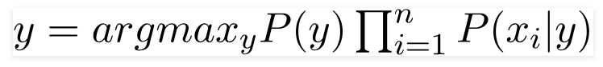

# Naive-Bayes-from-Scratch-in-Python

A Naive Bayes classifier is a probabilistic machine learning model that’s used for classification task. The crux of the classifier is based on the Bayes theorem.

## Bayes Theorem

## In Our Case
Bayes theorem can be rewritten as:

with feature vector X,

assume all features are mutually independent then,

## Select class with Highest probability

For all entries in the dataset, the denominator does not change, it remain static. Therefore, the denominator can be removed and a proportionality can be introduced.

There could be cases where the classification could be multivariate. Therefore, we need to find the class y with maximum probability.

Using the above function, we can obtain the class, given the predictors.

## Prior probability P(y) : frequency

### Class conditional probability P(x_i|y)

Since the way the values are present in the dataset changes, the formula for conditional probability changes to,i.e Gaussian Naive Bayes:

When the predictors take up a continuous value and are not discrete, we assume that these values are sampled from a gaussian distribution.

## Conclusion

Naive Bayes algorithms are mostly used in sentiment analysis, spam filtering, recommendation systems etc. They are fast and easy to implement but their biggest disadvantage is that the requirement of predictors to be independent. In most of the real life cases, the predictors are dependent, this hinders the performance of the classifier.

